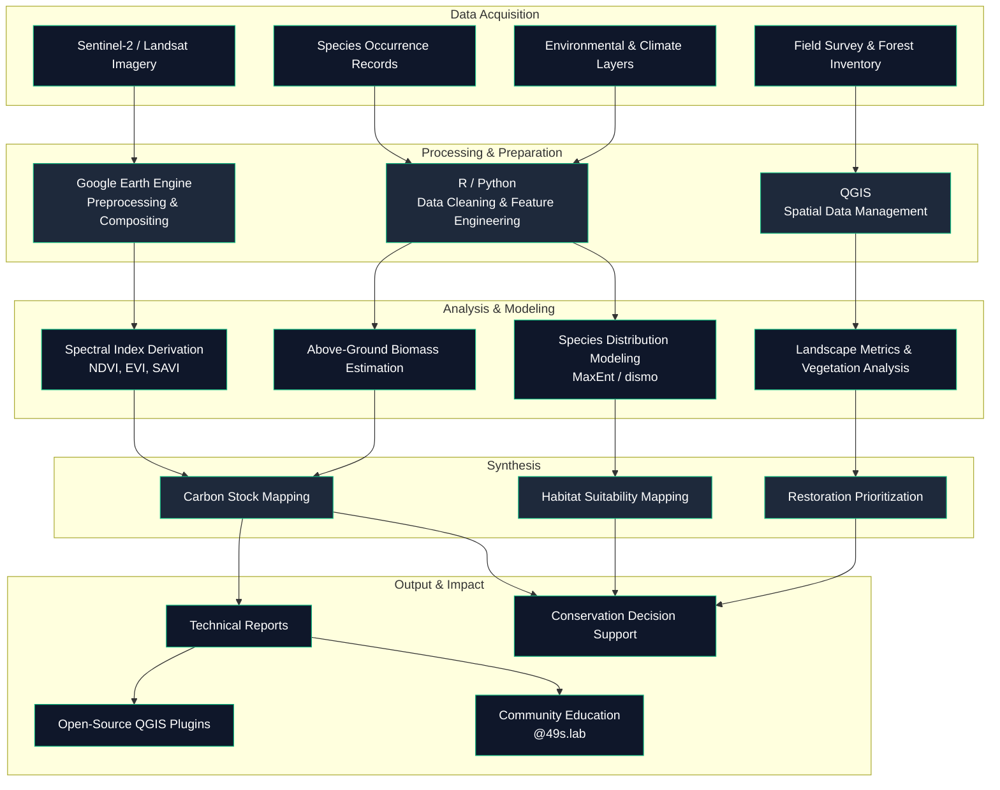

  

#   

**Forester | Ecology & Carbon Analyst | Species Distribution Modeling**

Forestry, ecology, and carbon science through open-source geospatial technology.

  
  
  
  
  
  
  
  
  

---

## About

- Bachelor of Forestry, Universitas Kuningan — graduated August 2026, GPA 3.88.
- Focus areas: forest and mangrove carbon stock mapping, ecological modeling, and species distribution modeling (SDM) for conservation and sustainability.
- Applies remote sensing data (Sentinel-2, Landsat) and spectral analysis to quantify above-ground biomass (AGB) and support restoration prioritization.
- Builds and maintains open-source geospatial workflows using QGIS, R, Python, and Google Earth Engine, including **RasterViz**, a QGIS plugin used by 900+ users worldwide.
- Shares knowledge on ecology, carbon, and open-source GIS with a community of 5,000+ followers through **@49s.lab**.

## Experience

| Role | Organization | Period |
|---|---|---|
| GIS Consultant | Redelong Institute, Rumah Berkelanjutan TFCA Program | Current |
| GIS Consultant, PECI Program | WWF Indonesia (home-based, Aceh) | Since September 2026 |
| Laboratory Assistant | Universitas Kuningan | 2025–2026 |
| GIS & Remote Sensing Tutor | Forum Pohon Langka Indonesia | 2025 |
| Social Forestry Facilitator | BPSKL Sumatera, Ministry of Environment and Forestry | 2024 |

## Forestry & Field Expertise

- **Forestry measurements:** biomass parameter measurement, forest inventory, wildlife inventory.
- **Vegetation & biometrics:** forest profile construction, vegetation analysis, forest biometrics.
- **Biodiversity survey:** Taman Nasional Gunung Ciremai (TNGC).
- **Coastal ecosystems:** mangrove survey and identification.

## Technical Stack

| Category | Python Ecosystem | R Ecosystem | Software / Spatial Tools |
| :--- | :--- | :--- | :--- |
| **Data & ML** |        |        |  |
| **Geospatial & Ecology** |           |           |              |
| **Visualization & GUI** |           |     |     |

---

## Featured Projects

| Project | What it is | Status |
|---|---|---|
| [**RasterViz**](https://github.com/Defani) | QGIS plugin (ID `qrviz`, GPL-2.0) for styling and visualizing raster layers — CRS reprojection fixes, discrete raster mode, canvas layout tools. Listed on the official QGIS Plugin Repository. | v1.4.5 · 900+ users |
| [**Ploots**](https://github.com/Defani) | Browser-based chart builder on Plotly.js/Fabric.js — sankey, choropleth (GeoJSON), radial and lollipop charts, with a data-view panel built around ecological/remote-sensing sample datasets. | Active development |
| [**Map-Biomas-style-QGIS-Toolbox**](https://github.com/Defani) | QGIS Processing script that applies the official MapBiomas Indonesia land-cover symbology to classified rasters in one step. | In development |

*(Update the links above to your actual repo URLs — placeholders point to your profile.)*

---

## GitHub Stats

  
  

  

  

<!--
Note on broken images (as of Sep 2026): github-readme-stats.vercel.app and
github-readme-activity-graph.vercel.app are shared free instances that
regularly hit GitHub's API rate limit and go down for everyone until they
reset or get redeployed — not something specific to this profile. Fixes
applied:
  - Stats + Top Languages: swapped to github-stats-extended.vercel.app (an
    actively maintained, API-compatible fork) with explicit hex colors so
    the cards match the dark navy / emerald palette used elsewhere in this
    README, instead of relying on a built-in theme preset.
  - Streak card: same explicit-hex approach, since herokuapp's built-in
    themes don't include one that matches this palette either.
  - Activity Graph: the official vercel.app endpoint was still down, so
    this now points at the community mirror reported in
    https://github.com/Ashutosh00710/github-readme-activity-graph/issues/197
    (fabianocouto-activity-graph.vercel.app). If that mirror also goes
    down later, swap back to github-readme-activity-graph.vercel.app once
    it recovers, or self-host either service.
  - Most reliable long-term fix for any of these: deploy your own instance
    on Vercel with your own GitHub token, so you're not sharing a rate
    limit with the entire internet.

Optional: a contribution "snake" animation (green squares crawling across your
graph) needs one extra step — it's generated by a GitHub Action, not just an
image tag. Add .github/workflows/snake.yml from
https://github.com/Platane/snk, then reference the generated SVG here, e.g.:

-->

---

## Workflow

---

## Research Interests

- Forest ecology and carbon modeling
- Mangrove biomass and carbon stock estimation
- Species distribution modeling
- Forestry and remote sensing
- Restoration prioritization
- Biodiversity conservation
- Sustainability through open-source geospatial tools
- Social forestry
- Environmental education

---

## Currently

- 🔭 Growing **RasterViz** past v1.4.5 and continuing development on **Ploots**.
- 🌱 Deepening mangrove AGB/carbon estimation workflows combining Sentinel-2 spectral indices with field allometry.
- 📫 Reachable at [defaniarman@gmail.com](mailto:defaniarman@gmail.com) or via the badges above.

---

  

